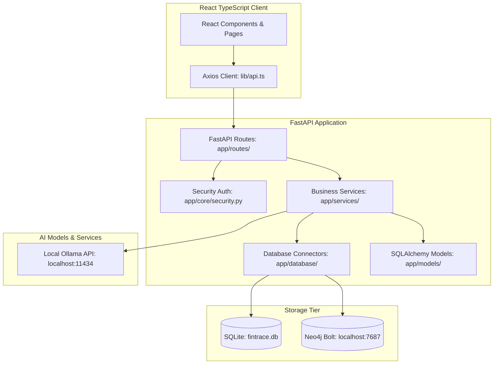

# FinTrace Architecture & Codebase Graph Review

> [!NOTE]
> This document is automatically generated by `codebase_mapper.py`. It provides a detailed call-graph and component dependency review of the FinTrace project to accelerate future development and code analysis.

## System Architecture Map

## 1. Database Connectors & Configurations

### `neo4j_driver` ([backend/app/database/neo4j_driver.py](file:///C:/Users/Atharv/OSINT & Finance/fintrace/backend/app/database/neo4j_driver.py))

FinTrace — Neo4j Graph Database Driver

Async Neo4j driver singleton with query helpers.
Gracefully degrades when Neo4j is unavailable (local dev without Docker).

- **Class**: `Neo4jDriver`
  - `async def connect(cls)`
  - `async def close(cls)`
  - `def is_available(cls)`
  - `def get_driver(cls)`
  - `async def run_query(cls, query, parameters, database)`
  - `async def run_write(cls, query, parameters, database)`
  - `async def setup_constraints(cls)`
- **Function**: `async def get_neo4j()`

### `postgres` ([backend/app/database/postgres.py](file:///C:/Users/Atharv/OSINT & Finance/fintrace/backend/app/database/postgres.py))

FinTrace — Database Driver

Async SQLAlchemy engine and session management.
Supports PostgreSQL (production) and SQLite (local dev).

- **Class**: `Base`
- **Function**: `async def get_db()`
- **Function**: `async def init_db()`
- **Function**: `async def close_db()`

## 2. SQLAlchemy ORM Models

### Model: `alert` ([backend/app/models/alert.py](file:///C:/Users/Atharv/OSINT & Finance/fintrace/backend/app/models/alert.py))

FinTrace — Alert Model

Stores AML detection alerts with severity, type, and investigation status.

- **ORM Class**: `JSONType` (inherits from `TypeDecorator`)
  *Description: Stores a dict as JSON text. Works with both PostgreSQL and SQLite.*
- **ORM Class**: `Alert` (inherits from `Base`)
  *Description: An AML detection alert generated by the detection engine.*

### Model: `blacklist` ([backend/app/models/blacklist.py](file:///C:/Users/Atharv/OSINT & Finance/fintrace/backend/app/models/blacklist.py))

FinTrace — Blacklisted Account Model

Stores known suspicious/blacklisted account identifiers.

- **ORM Class**: `BlacklistedAccount` (inherits from `Base`)
  *Description: A known suspicious or blacklisted account from uploaded lists.*

### Model: `transaction` ([backend/app/models/transaction.py](file:///C:/Users/Atharv/OSINT & Finance/fintrace/backend/app/models/transaction.py))

FinTrace — Transaction Model

Stores parsed and cleaned financial transactions.

- **ORM Class**: `StringListType` (inherits from `TypeDecorator`)
  *Description: Stores a list of strings as JSON text. Works with both PostgreSQL and SQLite.*
- **ORM Class**: `UUIDType` (inherits from `TypeDecorator`)
  *Description: UUID that works with both PostgreSQL (native UUID) and SQLite (String).*
- **ORM Class**: `Transaction` (inherits from `Base`)
  *Description: A single financial transaction extracted from uploaded data.*

### Model: `upload` ([backend/app/models/upload.py](file:///C:/Users/Atharv/OSINT & Finance/fintrace/backend/app/models/upload.py))

FinTrace — Upload Batch Model

Tracks file uploads and their processing status.

- **ORM Class**: `UploadBatch` (inherits from `Base`)
  *Description: Represents a single file upload and its processing state.*

### Model: `user` ([backend/app/models/user.py](file:///C:/Users/Atharv/OSINT & Finance/fintrace/backend/app/models/user.py))

FinTrace — User Model

Stores user accounts with role-based access control.

- **ORM Class**: `User` (inherits from `Base`)
  *Description: User account for authentication and role-based access.*

## 3. Business Logic Services

### Service: `ai_chat` ([backend/app/services/ai_chat.py](file:///C:/Users/Atharv/OSINT & Finance/fintrace/backend/app/services/ai_chat.py))

FinTrace — AI Chat Investigator

Interactive AI chat for investigating suspicious accounts and transactions.
Uses local Ollama LLM with transaction graph context.

- **Class**: `AIChatInvestigator`
  *Description: Interactive AI assistant for AML investigation.

Provides natural language Q&A about suspicious accounts,
transaction patterns, and risk assessments.*
  - `def __init__(self)`
  - `async def chat(self, question, context, conversation_history)`
    - *Answer an investigation question using AI.*
  - `async def explain_account(self, account_id, risk_data, alerts, transactions)`
    - *Generate a comprehensive explanation for why an account is flagged.*
  - `def _build_account_context(self, account_id, risk_data, alerts, transactions)`
    - *Build investigation context for an account.*
  - `async def _query_ollama(self, prompt)`
    - *Send prompt to Ollama and return the response.*

### Service: `ai_explainer` ([backend/app/services/ai_explainer.py](file:///C:/Users/Atharv/OSINT & Finance/fintrace/backend/app/services/ai_explainer.py))

FinTrace — AI Explainability Service

Provides human-readable explanations for why specific
transactions or accounts were flagged. Does not require LLM —
uses rule-based explanations with confidence scoring.

- **Class**: `AIExplainer`
  *Description: Provides rule-based explainability for flagged transactions and accounts.

For each alert type, generates:
- Why it was flagged
- Confidence score
- Supporting evidence
- Detection rule that triggered it*
  - `def explain_alert(alert_type, alert_data)`
    - *Generate an explanation for a single alert.*
  - `def explain_account_risk(account_id, risk_data, alerts)`
    - *Generate a comprehensive risk explanation for an account.*
  - `def _prepare_format_args(alert_type, alert_data)`
    - *Prepare template formatting arguments from alert data.*
  - `def _extract_evidence(alert_type, alert_data)`
    - *Extract human-readable evidence points from alert data.*
  - `def _get_recommendations(risk_level, flags)`
    - *Generate recommended actions based on risk level and flags.*

### Service: `aml_engine` ([backend/app/services/aml_engine.py](file:///C:/Users/Atharv/OSINT & Finance/fintrace/backend/app/services/aml_engine.py))

FinTrace — AML Detection Engine

Implements 7 anti-money laundering detection algorithms:
1. Circular Routing (DFS cycle detection)
2. Mule Account Detection (deposit/withdrawal pattern analysis)
3. Layering Detection (fan-out → fan-in patterns)
4. Structuring / Smurfing (sub-threshold splitting)
5. High Velocity Transfers (rapid sequential chains)
6. Dormant Account Reactivation (long inactivity then sudden activity)
7. Blacklisted Account Matching (cross-reference with watchlists)

- **Class**: `CycleAlert`
  *Description: A detected circular routing pattern.*
- **Class**: `MuleAlert`
  *Description: A detected mule account pattern.*
- **Class**: `LayeringChain`
  *Description: A detected layering (fan-out → fan-in) pattern.*
- **Class**: `StructuringAlert`
  *Description: A detected structuring/smurfing pattern.*
- **Class**: `VelocityChain`
  *Description: A detected high-velocity transfer chain.*
- **Class**: `DormantAlert`
  *Description: A detected dormant account reactivation.*
- **Class**: `BlacklistMatch`
  *Description: A blacklisted account match.*
- **Class**: `AMLEngine`
  *Description: Core AML detection engine.

Loads transaction data into a NetworkX DiGraph and runs
all 7 detection algorithms. Returns structured alerts.*
  - `def __init__(self)`
  - `def load_transactions(self, transactions)`
    - *Build a NetworkX MultiDiGraph from transaction records.*
  - `def detect_circular_routes(self, min_length, max_length)`
    - *Detect circular money flows: A → B → C → A.*
  - `def detect_mule_accounts(self, min_deposits, max_holding_minutes, consolidation_ratio)`
    - *Detect mule accounts: many small deposits → quick consolidation → large withdrawal.*
  - `def detect_layering(self, fan_out_threshold, depth)`
    - *Detect layering patterns: A → {B, C, D} → {E, F} → Shell.*
  - `def detect_structuring(self, threshold, margin_pct, time_window_hours, min_count)`
    - *Detect structuring: multiple transactions just below reporting threshold.*
  - `def detect_high_velocity(self, max_chain_minutes, min_hops)`
    - *Detect rapid sequential transfers: A→B→C→D→E within 30 minutes.*
  - `def detect_dormant_reactivation(self, dormancy_days, reactivation_threshold)`
    - *Detect accounts inactive for 180+ days that suddenly transact large amounts.*
  - `def match_blacklisted_accounts(self, blacklist)`
    - *Cross-reference all senders/receivers against a blacklist.*
  - `def run_all_detections(self, blacklist)`
    - *Run all 7 detection algorithms and return consolidated results.*

### Service: `cleaner` ([backend/app/services/cleaner.py](file:///C:/Users/Atharv/OSINT & Finance/fintrace/backend/app/services/cleaner.py))

FinTrace — Data Cleaning & Validation Service

Deduplication, validation, and standardization of parsed transaction data.

- **Class**: `CleaningReport`
  *Description: Tracks cleaning operations and their results.*
  - `def __init__(self)`
  - `def to_dict(self)`
- **Class**: `DataCleaner`
  *Description: Cleans and validates transaction DataFrames.

Pipeline:
1. Remove exact duplicates
2. Remove invalid records (missing required fields, invalid amounts)
3. Standardize dates to ISO 8601
4. Standardize amounts to 2 decimal places
5. Standardize currency codes
6. Normalize names (title case, trim whitespace)
7. Generate transaction hash for dedup*
  - `def clean(df)`
    - *Run the full cleaning pipeline on a transaction DataFrame.*
  - `def _clean_amounts(df)`
    - *Parse and validate amount values.*
  - `def _clean_dates(df)`
    - *Parse and standardize date/timestamp values to ISO 8601.*
  - `def _clean_currency(df)`
    - *Standardize currency codes to ISO 4217.*
  - `def _clean_names(df)`
    - *Normalize account names: trim, title case, collapse whitespace.*
  - `def _deduplicate_by_hash(df)`
    - *Remove semantic duplicates based on transaction content hash.*
  - `def _clean_metadata(df)`
    - *Clean optional metadata fields.*

### Service: `graph` ([backend/app/services/graph.py](file:///C:/Users/Atharv/OSINT & Finance/fintrace/backend/app/services/graph.py))

FinTrace — Neo4j Graph Builder Service

Builds and queries the transaction graph in Neo4j.
Each account becomes a node, each transaction becomes an edge.
Provides database-backed local fallbacks when Neo4j is unavailable.

- **Class**: `GraphBuilder`
  *Description: Builds the transaction graph in Neo4j from cleaned DataFrames.

Graph schema:
    (Account {account_id, name, bank, total_in, total_out, tx_count, risk_score})
    -[:TRANSFERRED {amount, timestamp, reference, mode, description, tx_id}]->
    (Account)*
  - `async def build_from_dataframe(df, batch_id)`
    - *Upsert accounts and transactions from a DataFrame into Neo4j.*
  - `async def get_full_graph(limit, skip)`
    - *Retrieve the full transaction graph (paginated).*
  - `async def get_account_subgraph(account_id, depth)`
    - *Get a subgraph centered on a specific account, N hops deep.*
  - `async def get_account_stats(account_id)`
    - *Get detailed statistics for a single account.*
  - `async def get_graph_stats()`
    - *Get high-level graph statistics.*
  - `async def update_account_risk(account_id, risk_score)`
    - *Update the risk score for an account node.*
  - `async def get_all_transactions_for_networkx()`
    - *Export all transactions for NetworkX analysis.*

### Service: `parser` ([backend/app/services/parser.py](file:///C:/Users/Atharv/OSINT & Finance/fintrace/backend/app/services/parser.py))

FinTrace — File Parser Service

Multi-format parser supporting CSV, Excel, PDF bank statements, and OCR.
Extracts transactions into a standardized Pandas DataFrame.

- **Class**: `CSVParser`
  *Description: Parse CSV files with auto-delimiter detection.*
  - `def parse(file_content, filename)`
    - *Parse CSV content into a standardized DataFrame.*
- **Class**: `ExcelParser`
  *Description: Parse Excel (.xlsx / .xls) files.*
  - `def parse(file_content, filename)`
    - *Parse Excel content into a standardized DataFrame.*
- **Class**: `PDFParser`
  *Description: Parse PDF bank statements using pdfplumber text extraction.
Falls back to OCR (Tesseract) for scanned documents.*
  - `def parse(file_content, filename)`
    - *Extract transactions from a PDF bank statement.*
  - `def _extract_text(file_content)`
    - *Extract text from PDF pages using pdfplumber.*
  - `def _ocr_extract(file_content)`
    - *Extract text from scanned PDF using Tesseract OCR.*
  - `def _parse_transactions(text)`
    - *Parse transaction lines from extracted text.*
- **Class**: `UnifiedParser`
  *Description: Factory that dispatches to the correct parser based on file type.*
  - `def detect_type(cls, filename, content_type)`
    - *Detect file type from filename extension or MIME type.*
  - `def parse(cls, file_content, filename, content_type)`
    - *Parse a file into a standardized DataFrame.*
- **Function**: `def _map_columns(df)`
- **Function**: `def _ensure_required_columns(df)`

### Service: `risk` ([backend/app/services/risk.py](file:///C:/Users/Atharv/OSINT & Finance/fintrace/backend/app/services/risk.py))

FinTrace — Risk Score Engine

Aggregates AML detection results into per-account risk scores.

Scoring Table:
| Rule                    | Points |
|-------------------------|--------|
| Circular Routing        | 35     |
| Mule Account            | 25     |
| Layering                | 20     |
| Structuring             | 15     |
| Blacklist Match         | 50     |
| High Velocity           | 20     |
| Dormant Reactivation    | 15     |

Risk Levels:
  0-30:   LOW    (green)
  31-60:  MEDIUM (yellow)
  61-100: HIGH   (red), capped at 100

- **Class**: `RiskScoreEngine`
  *Description: Computes per-account risk scores from AML detection results.

Each detection type adds its weight to every account involved.
Scores are capped at 100.*
  - `def compute_risk_scores(detection_results)`
    - *Compute risk scores for all accounts based on detection results.*
  - `def _extract_accounts(alert, detection_type)`
    - *Extract all account IDs involved in an alert.*
  - `def get_top_risk_accounts(risk_scores, limit)`
    - *Return the top N accounts by risk score, descending.*
  - `def get_risk_distribution(risk_scores)`
    - *Return count of accounts in each risk level.*
- **Function**: `def get_risk_level(score)`
- **Function**: `def get_risk_color(score)`

### Service: `sar_generator` ([backend/app/services/sar_generator.py](file:///C:/Users/Atharv/OSINT & Finance/fintrace/backend/app/services/sar_generator.py))

FinTrace — SAR Generator (Suspicious Activity Report)

Uses local Ollama LLM to generate official-style Suspicious Activity Reports
from detection results and transaction data.

- **Class**: `SARGenerator`
  *Description: Generates Suspicious Activity Reports using local Ollama LLM.

Flow:
1. Collect all alerts and risk data for target account(s)
2. Build structured context with transaction details
3. Send to Ollama with compliance-focused system prompt
4. Parse and return the SAR text*
  - `def __init__(self)`
  - `async def generate_sar(self, account_id, risk_data, alerts, transactions)`
    - *Generate a SAR for a specific account.*
  - `async def generate_chain_sar(self, chain, alerts, transactions)`
    - *Generate a SAR for an entire suspicious chain of accounts.*
  - `def _build_context(self, account_id, risk_data, alerts, transactions)`
    - *Build structured context text from account data.*
  - `def _build_chain_context(self, chain, alerts, transactions)`
    - *Build context for a chain-level SAR.*
  - `async def _query_ollama(self, prompt)`
    - *Send a prompt to the local Ollama LLM and return the response.*

## 4. API Endpoint Routers

### Router: `ai` ([backend/app/routes/ai.py](file:///C:/Users/Atharv/OSINT & Finance/fintrace/backend/app/routes/ai.py))

FinTrace — AI & SAR Routes

SAR generation, AI chat, explainability, and risk prediction endpoints.

- **Endpoint**: `router.post("/generate-sar")`
  - Handler: `async def generate_sar(request, current_user, db)`
  - *Generate a Suspicious Activity Report using local Ollama LLM.*
- **Endpoint**: `router.post("/chat")`
  - Handler: `async def ai_chat(request, current_user)`
  - *Interactive AI chat for AML investigation.*
- **Endpoint**: `router.get("/explain/account/{account_id}")`
  - Handler: `async def explain_account(account_id, current_user, db)`
  - *Get a detailed explanation of why an account is flagged.*
- **Endpoint**: `router.get("/explain/alert/{alert_id}")`
  - Handler: `async def explain_alert(alert_id, current_user, db)`
  - *Get a detailed explanation for a specific alert.*

### Router: `aml` ([backend/app/routes/aml.py](file:///C:/Users/Atharv/OSINT & Finance/fintrace/backend/app/routes/aml.py))

FinTrace — AML Detection Routes

Endpoints for running detection algorithms, viewing alerts,
risk scores, and managing blacklists.

- **Endpoint**: `router.post("/detect", response_model=RunDetectionResponse)`
  - Handler: `async def run_detection(request, current_user, db)`
  - *Run all 7 AML detection algorithms on the current transaction graph.*
- **Endpoint**: `router.get("/alerts")`
  - Handler: `async def list_alerts(alert_type, severity, status, page, page_size, current_user, db)`
  - *List all AML alerts with optional filtering.*
- **Endpoint**: `router.get("/cycles")`
  - Handler: `async def get_cycles(current_user, db)`
  - *Get all detected circular routing patterns.*
- **Endpoint**: `router.get("/mules")`
  - Handler: `async def get_mules(current_user, db)`
  - *Get all detected mule accounts.*
- **Endpoint**: `router.get("/layering")`
  - Handler: `async def get_layering(current_user, db)`
  - *Get all detected layering chains.*
- **Endpoint**: `router.get("/structuring")`
  - Handler: `async def get_structuring(current_user, db)`
  - *Get all detected structuring/smurfing patterns.*
- **Endpoint**: `router.get("/velocity")`
  - Handler: `async def get_velocity(current_user, db)`
  - *Get all detected high-velocity transfer chains.*
- **Endpoint**: `router.get("/dormant")`
  - Handler: `async def get_dormant(current_user, db)`
  - *Get all detected dormant account reactivations.*
- **Endpoint**: `router.get("/blacklist-matches")`
  - Handler: `async def get_blacklist_matches(current_user, db)`
  - *Get all detected blacklist matches.*
- **Endpoint**: `router.get("/risk")`
  - Handler: `async def get_all_risk_scores(current_user, db)`
  - *Get risk scores for all accounts.*
- **Endpoint**: `router.get("/risk/{account_id}")`
  - Handler: `async def get_account_risk(account_id, current_user, db)`
  - *Get detailed risk breakdown for a single account.*
- **Endpoint**: `router.post("/blacklist/upload")`
  - Handler: `async def upload_blacklist(file, current_user, db)`
  - *Upload a blacklist CSV file (admin only).*
- **Endpoint**: `router.get("/blacklist")`
  - Handler: `async def list_blacklist(current_user, db)`
  - *List all blacklisted accounts.*
- **Endpoint**: `Unknown`
  - Handler: `async def _get_alerts_by_type(db, alert_type)`
  - *Helper to fetch alerts by type.*
- **Endpoint**: `Unknown`
  - Handler: `def _get_severity(risk_score)`
- **Endpoint**: `Unknown`
  - Handler: `def _get_alert_title(detection_type, data)`
- **Endpoint**: `Unknown`
  - Handler: `def _get_alert_description(detection_type, data)`

### Router: `auth` ([backend/app/routes/auth.py](file:///C:/Users/Atharv/OSINT & Finance/fintrace/backend/app/routes/auth.py))

FinTrace — Authentication Routes

JWT login, registration, token refresh, and user profile endpoints.

- **Endpoint**: `router.post("/login", response_model=TokenPair)`
  - Handler: `async def login(form_data, db)`
  - *Authenticate user and return JWT token pair.*
- **Endpoint**: `router.post("/register", response_model=UserResponse)`
  - Handler: `async def register(request, db, current_user)`
  - *Register a new user (admin only).*
- **Endpoint**: `router.get("/me", response_model=UserResponse)`
  - Handler: `async def get_current_profile(current_user, db)`
  - *Get the current authenticated user's profile.*
- **Endpoint**: `router.post("/refresh", response_model=TokenPair)`
  - Handler: `async def refresh_token(request)`
  - *Refresh an access token using a valid refresh token.*
- **Endpoint**: `router.post("/setup", response_model=UserResponse)`
  - Handler: `async def initial_setup(db)`
  - *Create the initial admin user if no users exist.*

### Router: `dashboard` ([backend/app/routes/dashboard.py](file:///C:/Users/Atharv/OSINT & Finance/fintrace/backend/app/routes/dashboard.py))

FinTrace — Dashboard & Analytics Routes

Dashboard summary statistics and analytics data for charts.

- **Endpoint**: `router.get("/dashboard")`
  - Handler: `async def get_dashboard(current_user, db)`
  - *Dashboard summary statistics.*
- **Endpoint**: `router.get("/analytics")`
  - Handler: `async def get_analytics(current_user, db)`
  - *Analytics data for charts and visualizations.*

### Router: `transactions` ([backend/app/routes/transactions.py](file:///C:/Users/Atharv/OSINT & Finance/fintrace/backend/app/routes/transactions.py))

FinTrace — Transaction & Graph Routes

Transaction listing, graph data, and account subgraph endpoints.

- **Endpoint**: `router.get("/transactions")`
  - Handler: `async def list_transactions(page, page_size, sender, receiver, min_amount, max_amount, mode, current_user, db)`
  - *List all transactions with pagination and filtering.*
- **Endpoint**: `router.get("/transactions/{transaction_id}")`
  - Handler: `async def get_transaction(transaction_id, current_user, db)`
  - *Get details for a single transaction.*
- **Endpoint**: `router.get("/graph")`
  - Handler: `async def get_graph(limit, skip, current_user)`
  - *Get the full transaction graph for visualization.*
- **Endpoint**: `router.get("/graph/{account_id}")`
  - Handler: `async def get_account_subgraph(account_id, depth, current_user)`
  - *Get a subgraph centered on a specific account.*

### Router: `upload` ([backend/app/routes/upload.py](file:///C:/Users/Atharv/OSINT & Finance/fintrace/backend/app/routes/upload.py))

FinTrace — Upload & Parse Routes

File upload, parsing trigger, and upload status endpoints.

- **Endpoint**: `router.post("/upload", response_model=UploadResponse)`
  - Handler: `async def upload_file(file, current_user, db)`
  - *Upload a transaction file (CSV, Excel, or PDF).*
- **Endpoint**: `router.post("/parse", response_model=ParseResponse)`
  - Handler: `async def parse_upload(upload_id, current_user, db)`
  - *Parse an uploaded file: extract transactions, clean data, build graph.*
- **Endpoint**: `router.get("/uploads")`
  - Handler: `async def list_uploads(current_user, db)`
  - *List all file uploads with their processing status.*
- **Endpoint**: `router.get("/uploads/{upload_id}")`
  - Handler: `async def get_upload_detail(upload_id, current_user, db)`
  - *Get detailed info about an upload including parsed records.*
